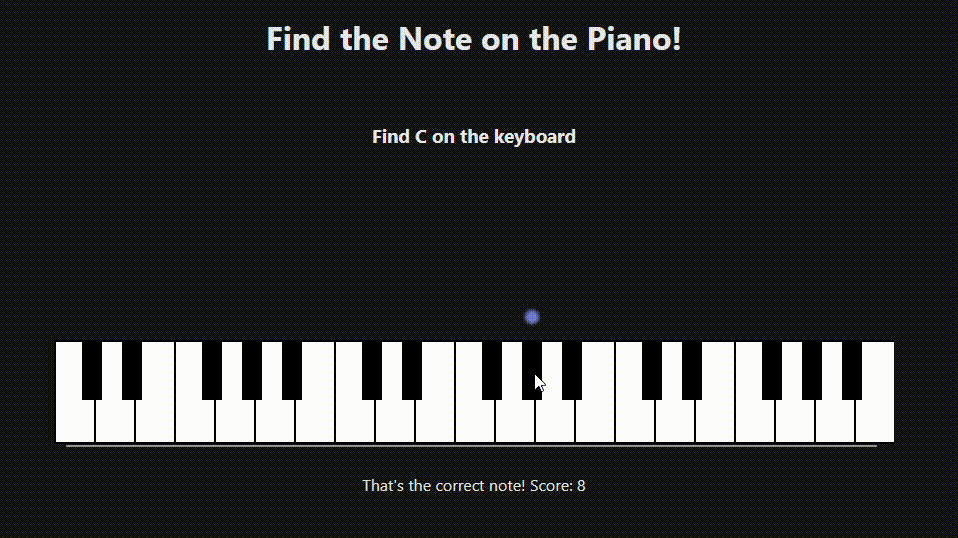

# Piano Trainer

A browser piano trainer for note recognition and scale practice, built with React + TypeScript and the Web Audio API.

**Live demo →  <https://piano-trainer-chi.vercel.app/>**



---

## Features

- **Note Recognition Exercise** — Given a random note, identify its spot on the virtual piano
- **Scales** — Given a random root note for a major or minor scale, select all the notes in the respective scale

## Tech stack

| Tool | Why |
|---|---|
| React | Hooks let each exercise's state live in its own custom hook, independent of how it's rendered. |
| TypeScript | A key's visual state is one `NoteState` union shared by the hook, `Keyboard`, and `PianoKey`. Since each value is also a CSS class, a typo would render an unstyled key with no error — the union turns that into a compile failure. |
| Web Audio API | Tones are synthesised directly from an oscillator so no samples are required. |
| Jest + React Testing Library | Pure functions (`buildScale`, `getFrequency`) unit-tested directly; component tests query by role and label, the way a user finds things. |
| Express + PostgreSQL (`server/`) | Practice history API, written with raw SQL (no ORM) — see [server/README.md](server/README.md). |

## Running locally

```bash
git clone https://github.com/BCThunder/piano-trainer
cd piano-trainer
npm install
npm start
```

Then open <http://localhost:3000>.

Run the test suite:

```bash
npm test
```

## What I learned

### Custom hooks as the logic/render boundary

All of `ScaleExercise`'s state and rules live in `useScaleExercise.tsx`; the component itself holds none and only renders. The immediate payoff was testing — `src/tests/useScaleExercise.test.tsx` uses `renderHook` to exercise the scale logic with no component, no keyboard, and no clicking. The less obvious payoff was reuse: `useNoteExercise` ended up returning the same shape, so a single `Keyboard` component drives both exercises without knowing which one it's attached to.

### Derived state over stored state

`useScaleExercise` stores only what can't be computed: the pressed notes, the root, the scale, and the score. Everything else — `scaleNotes`, `targetNotes`, `isComplete`, `stepSequence`, `noteStates` — is recalculated on every render. Each value you store is one you can forget to update, and those bugs surface as a UI that disagrees with itself.

The lesson came from getting it wrong. In `onNotePressed` I called `setPressedNotes` and then checked `pressedNotes.size` on the next line to see whether the scale was finished. It never fired: `pressedNotes` is bound at render time, and `setPressedNotes` schedules a re-render rather than reassigning it, so I was reading a Set one note short. The fix was to build `new Set(pressedNotes).add(note)` first and check that — which also hands React a new reference, without which it would compare the old and new state with `Object.is`, find them identical, and skip the re-render entirely.

The contrast is visible in my other hook: `useNoteExercise` *stores* `noteStates`, and so has to remember `setNoteStates({})` on every correct answer. The derived version in `useScaleExercise` can't fall out of sync because there is nothing to keep in sync.

### Working with a browser API directly (Web Audio)

The `AudioContext` lives in a `useRef`, not `useState`, and is created lazily on the first note played. It's a mutable browser resource rather than rendered data — nothing about it ever appears in the output — so keeping it in state would buy nothing and cost a re-render the first time someone pressed a key. Refs are for values that need to survive across renders without the UI depending on them.

Skipping a synth library meant implementing pitch myself. `getFrequency` converts a name like `"C4"` into a MIDI note number and then into hertz with `440 * 2 ** ((midi - 69) / 12)`: an octave is a doubling of frequency, twelve equal semitones divide it evenly, and A4 = 440 Hz is the reference the rest hangs off. Each note is a triangle-wave oscillator through a gain node with an exponential ramp down to near-silence, which is the difference between a piano-ish note and a test tone.
